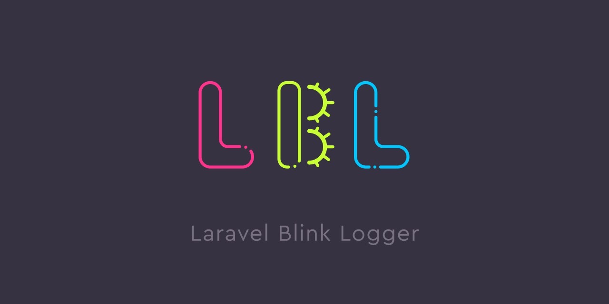

# Laravel Blink Logger

[](https://packagist.org/packages/ucan-lab/laravel-blink-logger)
[](https://packagist.org/packages/ucan-lab/laravel-blink-logger)
[](https://packagist.org/packages/ucan-lab/laravel-blink-logger)
[](https://packagist.org/packages/ucan-lab/laravel-blink-logger)
[](https://packagist.org/packages/ucan-lab/laravel-blink-logger)

[English](README.md) | 日本語

Laravel 向けの包括的なロギングツールです。

## 動作要件

| パッケージ | バージョン            |
|------------|--------------------|
| PHP        | ^8.3               |
| Laravel    | ^12.0 / ^13.0      |

> [!NOTE]
> このメジャーリリースより、Laravel 11 と PHP 8.2 はサポート対象外となりました。いずれもセキュリティサポート期間が終了しているため、本パッケージは PHP 8.3 以降・Laravel 12 以降を対象とします。Laravel 11 または PHP 8.2 をお使いの場合は、本バージョンをインストールする前にアップグレードするか、従来のメジャーラインをご利用ください。

## インストール

composer で本パッケージを要求します。開発用途でのみインストールすることを推奨します。

```
$ composer require --dev ucan-lab/laravel-blink-logger
```

デバッグログの出力はデフォルトで無効になっているため、`.env` で有効化してください。

```
LOG_QUERY_ENABLED=true
LOG_HTTP_REQUEST_ENABLED=true
LOG_HTTP_RESPONSE_ENABLED=true
LOG_HTTP_CLIENT_REQUEST_ENABLED=true
LOG_HTTP_CLIENT_RESPONSE_ENABLED=true
```

### [オプション] 設定ファイルの公開

publish コマンドでパッケージの設定をアプリ側の設定にコピーできます。

```
$ php artisan vendor:publish --tag=blink-logger
```

## 設定

設定ファイルを公開したあと、`config/blink-logger.php` で以下のオプションを設定できます。

### マスキング (`redact`)

機微な値はログに出力される前にマスキングされます。マスキングはすべてのロガー（HTTP リクエスト/レスポンス、HTTP クライアントのリクエスト/レスポンス）に適用されます。

| キー | デフォルト | 説明 |
|-----|---------|-------------|
| `redact.placeholder` | `***` | マスキングした値を置き換える文字列です。 |
| `redact.headers` | 設定ファイル参照 | 値をプレースホルダーに置き換えるヘッダー名（大文字小文字を区別しない）のリストです。デフォルトには `authorization`、`cookie`、`set-cookie`、`x-api-key`、`x-xsrf-token`、`proxy-authorization`、`php-auth-pw`、`x-auth-token`、`x-access-token` が含まれます。 |
| `redact.body_keys` | 設定ファイル参照 | 値をプレースホルダーに置き換えるリクエスト/レスポンスボディのキー（大文字小文字を区別せず、再帰的に適用）のリストです。デフォルトには `password`、`token`、`access_token`、`refresh_token`、`secret`、`api_key`、`authorization`、`credit_card`、`card_number`、`cvv`、`client_secret`、`private_key`、`passphrase` が含まれます。 |

**URL クエリ文字列のマスキング**: URL のクエリ文字列内のパラメータ（例: `?token=secret`）も、そのキーが `redact.body_keys` に一致する場合はマスキングされます。これは受信した HTTP リクエストの URL と、送信する HTTP クライアントリクエストの URL の両方に適用されます。

**JSON 以外のレスポンスボディ**: ボディキーのマスキングは、レスポンスボディが JSON としてパース可能な場合（Content-Type が `application/json`、`application/ld+json`、`application/*+json`、`text/json`）にのみ適用されます。生の文字列レスポンスボディは、キーベースのマスキングを行わずにそのままログ出力されます。

マスキング対象のリストをカスタマイズするには、設定ファイルを公開して `config/blink-logger.php` を編集してください。

### クエリロガー (`query`)

| キー | デフォルト | 環境変数 | 説明 |
|-----|---------|--------------|-------------|
| `query.enabled` | `false` | `LOG_QUERY_ENABLED` | クエリログの有効/無効を切り替えます。 |
| `query.channel` | `config('logging.default')` | — | クエリログを書き込むログチャンネルです。 |
| `query.slow_query_time` | `2000` | `LOG_SQL_SLOW_QUERY_TIME` | ミリ秒単位のしきい値です。この値を超えたクエリは `debug` ではなく `warning` レベルでログ出力されます。 |
| `query.redact_bindings` | `false` | `LOG_SQL_REDACT_BINDINGS` | `true` の場合、SQL のバインディングはクエリ文字列に展開**されません**。代わりにプレースホルダー（`?`）を含む生のパラメータ化された SQL がログ出力され、バインディングの値がログに現れるのを防ぎます。既存の挙動を維持するため、デフォルトは `false` です。 |

> [!WARNING]
> `query.enabled` が `true` で `query.redact_bindings` が `false`（デフォルト）の場合、パスワード・トークンなどの機微なデータを含む SQL のバインディング値が、ログ出力される SQL 文字列に展開され、平文でログに残ります。**本番環境でクエリログを有効化する場合は `LOG_SQL_REDACT_BINDINGS=true` を設定してください。** これにより機微なバインディング値がログに漏れるのを防げます。

| キー | デフォルト | 環境変数 | 説明 |
|-----|---------|--------------|-------------|
| `query.listeners` | 設定ファイル参照 | — | データベースイベントクラスとリスナークラスのマッピングです。`QueryExecuted`、`TransactionBeginning`、`TransactionCommitted`、`TransactionRolledBack` を対象とします。 |

### HTTP リクエストロガー (`http.request`)

| キー | デフォルト | 環境変数 | 説明 |
|-----|---------|--------------|-------------|
| `http.request.enabled` | `false` | `LOG_HTTP_REQUEST_ENABLED` | 受信 HTTP リクエストのログ出力の有効/無効を切り替えます。 |
| `http.request.channel` | `config('logging.default')` | — | HTTP リクエストログを書き込むログチャンネルです。 |
| `http.request.include_paths` | `[]` | — | 空でない場合、ここに指定したいずれかの値にパスが一致するリクエストのみをログ出力します（Laravel の `Request::is()` による `*` ワイルドカードパターンに対応。例: `api/*`。完全一致も可）。`exclude_paths` より優先されます。 |
| `http.request.exclude_paths` | `[]` | — | `include_paths` が空の場合、ここに指定したいずれかの値にパスが一致するリクエストはスキップされます（Laravel の `Request::is()` による `*` ワイルドカードパターンに対応。例: `admin/*`。完全一致も可）。`include_paths` が空でない場合は効果がありません。 |
| `http.request.middleware_group_names` | `['web', 'api']` | — | リクエストロガーのミドルウェアを登録するミドルウェアグループです。 |

### HTTP レスポンスロガー (`http.response`)

| キー | デフォルト | 環境変数 | 説明 |
|-----|---------|--------------|-------------|
| `http.response.enabled` | `false` | `LOG_HTTP_RESPONSE_ENABLED` | 受信 HTTP レスポンスのログ出力の有効/無効を切り替えます。 |
| `http.response.channel` | `config('logging.default')` | — | HTTP レスポンスログを書き込むログチャンネルです。 |
| `http.response.include_paths` | `[]` | — | 空でない場合、ここに指定したいずれかの値にパスが一致するレスポンスのみをログ出力します（Laravel の `Request::is()` による `*` ワイルドカードパターンに対応。例: `api/*`。完全一致も可）。`exclude_paths` より優先されます。 |
| `http.response.exclude_paths` | `[]` | — | `include_paths` が空の場合、ここに指定したいずれかの値にパスが一致するレスポンスはスキップされます（Laravel の `Request::is()` による `*` ワイルドカードパターンに対応。例: `admin/*`。完全一致も可）。`include_paths` が空でない場合は効果がありません。 |
| `http.response.middleware_group_names` | `['api']` | — | レスポンスロガーのミドルウェアを登録するミドルウェアグループです。 |

### HTTP クライアントリクエストロガー (`http_client.request`)

| キー | デフォルト | 環境変数 | 説明 |
|-----|---------|--------------|-------------|
| `http_client.request.enabled` | `false` | `LOG_HTTP_CLIENT_REQUEST_ENABLED` | 送信 HTTP クライアントリクエストのログ出力の有効/無効を切り替えます。 |
| `http_client.request.channel` | `config('logging.default')` | — | HTTP クライアントリクエストログを書き込むログチャンネルです。 |

### HTTP クライアントレスポンスロガー (`http_client.response`)

| キー | デフォルト | 環境変数 | 説明 |
|-----|---------|--------------|-------------|
| `http_client.response.enabled` | `false` | `LOG_HTTP_CLIENT_RESPONSE_ENABLED` | 送信 HTTP クライアントレスポンスのログ出力の有効/無効を切り替えます。 |
| `http_client.response.channel` | `config('logging.default')` | — | HTTP クライアントレスポンスログを書き込むログチャンネルです。 |

## 使い方

ログファイルを監視します。

```
$ tail -f storage/logs/laravel.log
```

ログの出力例です。

```
[2024-04-05 16:38:58] local.DEBUG: GET: http://example-app.test/api/foo/bar?baz=qux {"request":{"baz":"qux"},"headers":{"accept-language":["ja,en-US;q=0.9,en;q=0.8"],"accept-encoding":["gzip, deflate"],"accept":["text/html,application/xhtml+xml,application/xml;q=0.9,image/avif,image/webp,image/apng,*/*;q=0.8,application/signed-exchange;v=b3;q=0.7"],"user-agent":["Mozilla/5.0 (Macintosh; Intel Mac OS X 10_15_7) AppleWebKit/537.36 (KHTML, like Gecko) Chrome/123.0.0.0 Safari/537.36"],"upgrade-insecure-requests":["1"],"cache-control":["max-age=0"],"connection":["keep-alive"],"host":["example-app.test"]}} 
[2024-04-05 16:38:58] local.DEBUG: START TRANSACTION  
[2024-04-05 16:38:59] local.DEBUG: 4.01 ms, SQL: insert into `users` (`name`, `email`, `email_verified_at`, `password`, `remember_token`, `updated_at`, `created_at`) values ('Concepcion VonRueden Sr.', 'judy30@example.net', '2024-04-05 16:38:58', 'y$L7Lb.DoH7sO5Zb7RrGtSzelx6Y15gBtetVYlI4z4wB5I83oh6To1i', 'ZD34nR26LH', '2024-04-05 16:38:59', '2024-04-05 16:38:59');  
[2024-04-05 16:38:59] local.DEBUG: 3.02 ms, SQL: update `users` set `name` = 'change name', `users`.`updated_at` = '2024-04-05 16:38:59' where `id` = 122;  
[2024-04-05 16:38:59] local.DEBUG: 1.61 ms, SQL: delete from `users` where `id` = 122;  
[2024-04-05 16:38:59] local.DEBUG: 2.28 ms, SQL: insert into `users` (`name`, `email`, `email_verified_at`, `password`, `remember_token`, `updated_at`, `created_at`) values ('Delfina Brakus IV', 'anibal.cummings@example.org', '2024-04-05 16:38:59', 'y$L7Lb.DoH7sO5Zb7RrGtSzelx6Y15gBtetVYlI4z4wB5I83oh6To1i', 'Qvq73GjdiQ', '2024-04-05 16:38:59', '2024-04-05 16:38:59');  
[2024-04-05 16:38:59] local.DEBUG: COMMIT  
[2024-04-05 16:38:59] local.DEBUG: 2.15 ms, SQL: select * from `users` where `users`.`id` = 123 limit 1;  
[2024-04-05 16:38:59] local.DEBUG: 200 OK {"body":"{\"data\":\"ok\"}","headers":{"cache-control":["no-cache, private"],"date":["Fri, 05 Apr 2024 16:38:59 GMT"],"content-type":["application/json"],"x-ratelimit-limit":["60"],"x-ratelimit-remaining":["55"],"access-control-allow-origin":["*"]}} 
```
